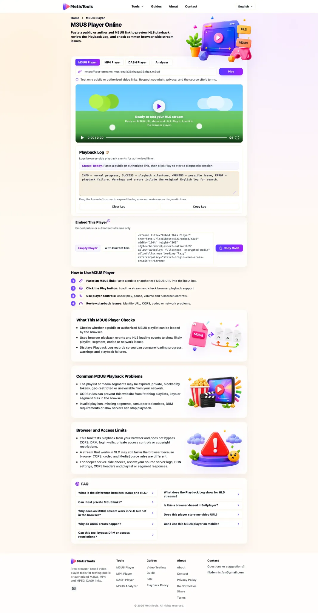

# MetisTools M3U8 Player

[English](./README.md) | [简体中文](./README.zh-CN.md)

[](https://metistools.com/m3u8-player)
[](https://metistools.com/m3u8-player)
[](https://metistools.com/)
[](./LICENSE)

A practical M3U8/HLS playback testing resource for developers, site owners, and technical users.

MetisTools helps you test public or authorized M3U8/HLS links directly in the browser, review playback logs, and understand common browser-side stream issues such as CORS, expired URLs, MIME types, codecs, and source-server access rules.

<p align="center">
  <a href="https://metistools.com/m3u8-player">
    
  </a>
</p>

## Live tools

| Tool | Use case |
|---|---|
| [M3U8 Player Online](https://metistools.com/m3u8-player) | Test public or authorized HLS/M3U8 playback in the browser. |
| [MP4 Player Online](https://metistools.com/mp4-player) | Check direct MP4 video links and browser playback support. |
| [DASH Player Online](https://metistools.com/dash-player) | Test DASH/MPD playback in the browser. |
| [Guides](https://metistools.com/guides) | Learn how browser playback, CORS, codecs, and stream URLs work. |

## What this repository is for

Use these notes when you need to:

- Test whether an M3U8/HLS stream can play in a modern browser.
- Check why a stream works in Safari or VLC but fails in Chrome or Edge.
- Review CORS, MIME type, codec, HTTPS, signed URL, and segment-loading issues.
- Embed a lightweight M3U8 player on a page you control.
- Compare common open source playback libraries before building your own web player.
- Document a safe workflow for testing public or authorized streams.

## What this repository is not for

This repository does not cover:

- Video downloading or stream ripping.
- DRM bypassing or decryption workarounds.
- Login, cookie, token, paywall, or private-access bypasses.
- Copyright-restricted redistribution.
- “Download any video” workflows.

If a stream is private, protected, signed, or permission-limited, the source owner must provide the correct access model. Browser tools cannot safely bypass source-side restrictions.

## Start here

Recommended reading order:

1. [Public M3U8 Test Stream Checklist](guides/public-test-stream-checklist.md)
2. [How to Test an M3U8 Stream in a Browser](guides/test-m3u8-stream-in-browser.md)
3. [M3U8 Playlist Basics for Browser Playback](guides/m3u8-playlist-basics.md)
4. [M3U8 CORS Error: What to Check First](guides/m3u8-cors-error.md)
5. [HLS Not Playing in Chrome: Practical Checks](guides/hls-not-playing-in-chrome.md)

## Browser playback guides

- [How to Test an M3U8 Stream in a Browser](guides/test-m3u8-stream-in-browser.md)
- [Safari HLS vs Chrome HLS: Browser Playback Differences](guides/safari-hls-vs-chrome-hls.md)
- [HLS Not Playing in Chrome: Practical Checks](guides/hls-not-playing-in-chrome.md)
- [M3U8 CORS Error: What to Check First](guides/m3u8-cors-error.md)
- [M3U8 Playlist Basics for Browser Playback](guides/m3u8-playlist-basics.md)
- [Public M3U8 Test Stream Checklist](guides/public-test-stream-checklist.md)

## Developer resources

- [Embed an M3U8 Player on Your Site](guides/embed-m3u8-player-on-your-site.md)
- [Open Source M3U8 Player Libraries](guides/open-source-m3u8-player-libraries.md)

These resources make the repository useful beyond a single online player page. They explain how to embed a player safely and how to choose a playback library when building your own implementation.

## Quick browser test workflow

1. Confirm that the URL is a direct `.m3u8` playlist, not a normal video webpage.
2. Confirm that the stream is public or that you are authorized to test it.
3. Open the URL in [MetisTools M3U8 Player](https://metistools.com/m3u8-player).
4. Compare Chrome or Edge with Safari if the result is unclear.
5. Check whether the playlist, media playlist, and media segments load.
6. Record HTTP status codes, CORS messages, MIME type, codec information, and whether the URL is signed or temporary.
7. Fix the source server or CDN configuration when needed.

## Embed example

Use the empty embed player when you want users to paste their own public or authorized stream URL:

```html
<iframe
  title="MetisTools M3U8 Player"
  src="https://metistools.com/embed/m3u8"
  width="100%"
  height="360"
  style="border:0;aspect-ratio:16/9"
  allow="autoplay; fullscreen; encrypted-media"
  allowfullscreen
  loading="lazy"
  referrerpolicy="strict-origin-when-cross-origin">
</iframe>
```

If you include a stream URL, use only public or authorized links. Iframe embedding does not hide, proxy, or protect the original media URL.

See: [Embed an M3U8 Player on Your Site](guides/embed-m3u8-player-on-your-site.md)

## Recommended GitHub topics

```text
m3u8
hls
hls-player
m3u8-player
video-player
streaming
browser-video
hls-js
videojs
dash
mp4
web-tools
```

## Safe use boundary

The notes here are for public or authorized playback testing. They are not legal advice, CDN configuration guarantees, or instructions for bypassing source-side restrictions.

## License

MIT License. See [LICENSE](LICENSE).
