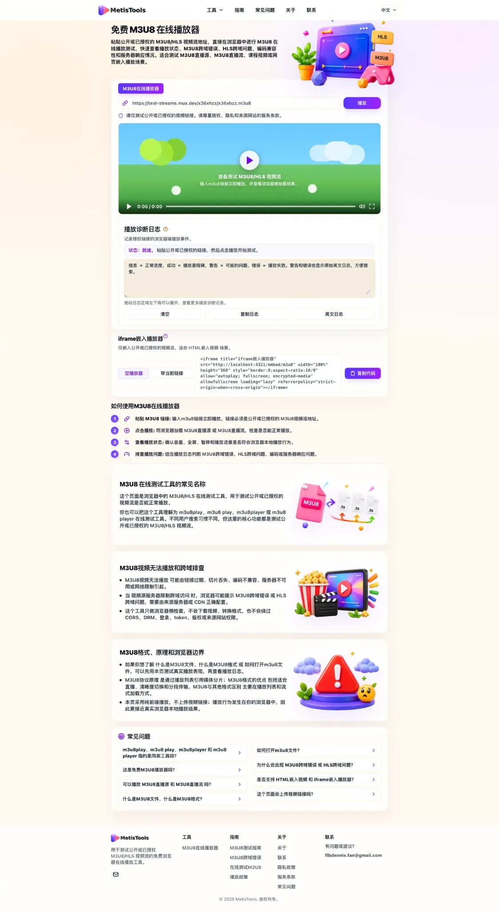

# MetisTools M3U8 Player

[English](./README.md) | [简体中文](./README.zh-CN.md)

[](https://metistools.com/zh/m3u8-player)
[](https://metistools.com/zh/m3u8-player)
[](https://metistools.com/zh/)
[](./LICENSE)

这是一个面向开发者、站长和技术用户的 M3U8/HLS 播放测试资料库。

MetisTools 可用于在浏览器中测试公开或已授权的 M3U8/HLS 链接，查看播放诊断日志，并理解常见的浏览器端播放问题，例如 CORS、链接过期、MIME 类型、编码支持、CDN 配置和源站访问限制。

<p align="center">
  <a href="https://metistools.com/zh/m3u8-player">
    
  </a>
</p>

## 在线工具

| 工具 | 用途 |
|---|---|
| [M3U8 在线播放器](https://metistools.com/zh/m3u8-player) | 在浏览器中测试公开或已授权的 HLS/M3U8 播放。 |
| [MP4 Player Online](https://metistools.com/mp4-player) | 检查直接 MP4 链接和浏览器播放支持。 |
| [DASH Player Online](https://metistools.com/dash-player) | 测试 DASH/MPD 链接在浏览器中的播放情况。 |
| [Guides](https://metistools.com/guides) | 了解浏览器播放、CORS、编码、流媒体链接等问题。 |

## 这个仓库适合什么场景

你可以用这些资料来：

- 判断一个 M3U8/HLS 流是否能在现代浏览器中播放。
- 排查为什么同一个流在 Safari 或 VLC 可以播放，但在 Chrome 或 Edge 中失败。
- 理解 CORS、MIME 类型、编码、HTTPS、签名 URL 和分片加载问题。
- 在自己控制的网站中嵌入一个轻量 M3U8 播放器。
- 对比常见开源播放器库，决定是否使用 hls.js、video.js 或其他方案。
- 记录一个安全、清晰的公开或授权视频流测试流程。

## 这个仓库不做什么

本仓库不覆盖：

- 视频下载或流媒体抓取。
- DRM 绕过或解密规避。
- 登录、Cookie、token、付费墙或私有访问绕过。
- 受版权限制内容的再分发。
- “下载任意视频”类流程。

如果视频流是私有的、受保护的、带签名的或有访问权限限制，应由内容源站提供正确的访问方式。浏览器工具不能安全地绕过源站限制。

## 推荐阅读顺序

1. [Public M3U8 Test Stream Checklist](guides/public-test-stream-checklist.md)
2. [How to Test an M3U8 Stream in a Browser](guides/test-m3u8-stream-in-browser.md)
3. [M3U8 Playlist Basics for Browser Playback](guides/m3u8-playlist-basics.md)
4. [M3U8 CORS Error: What to Check First](guides/m3u8-cors-error.md)
5. [HLS Not Playing in Chrome: Practical Checks](guides/hls-not-playing-in-chrome.md)

## 浏览器播放测试指南

- [How to Test an M3U8 Stream in a Browser](guides/test-m3u8-stream-in-browser.md)
- [Safari HLS vs Chrome HLS: Browser Playback Differences](guides/safari-hls-vs-chrome-hls.md)
- [HLS Not Playing in Chrome: Practical Checks](guides/hls-not-playing-in-chrome.md)
- [M3U8 CORS Error: What to Check First](guides/m3u8-cors-error.md)
- [M3U8 Playlist Basics for Browser Playback](guides/m3u8-playlist-basics.md)
- [Public M3U8 Test Stream Checklist](guides/public-test-stream-checklist.md)

## 开发者资源

- [Embed an M3U8 Player on Your Site](guides/embed-m3u8-player-on-your-site.md)
- [Open Source M3U8 Player Libraries](guides/open-source-m3u8-player-libraries.md)

这些内容的目的不是只推广一个在线播放器页面，而是帮助开发者理解如何安全嵌入播放器，以及如何选择适合自己的 M3U8/HLS 播放方案。

## 快速测试流程

1. 确认 URL 是直接 `.m3u8` 播放列表，而不是普通视频网页。
2. 确认该流是公开的，或你有权限测试。
3. 打开 [MetisTools M3U8 在线播放器](https://metistools.com/zh/m3u8-player)。
4. 如果结果不明确，可以对比 Chrome、Edge 和 Safari。
5. 检查 playlist、media playlist 和 media segments 是否能加载。
6. 记录 HTTP 状态码、CORS 信息、MIME 类型、编码信息，以及 URL 是否为临时签名链接。
7. 如果需要，回到源站或 CDN 配置中修复响应头、HTTPS、MIME 或访问权限问题。

## 嵌入示例

如果你希望用户自行粘贴公开或已授权的流地址，可以使用空播放器：

```html
<iframe
  title="MetisTools M3U8 Player"
  src="https://metistools.com/embed/m3u8"
  width="100%"
  height="360"
  style="border:0;aspect-ratio:16/9"
  allow="autoplay; fullscreen; encrypted-media"
  allowfullscreen
  loading="lazy"
  referrerpolicy="strict-origin-when-cross-origin">
</iframe>
```

如果你在 iframe 中传入具体流地址，只应使用公开或已授权的链接。iframe 嵌入不会隐藏、代理或保护原始媒体 URL。

参考：[Embed an M3U8 Player on Your Site](guides/embed-m3u8-player-on-your-site.md)

## 推荐 GitHub Topics

```text
m3u8
hls
hls-player
m3u8-player
video-player
streaming
browser-video
hls-js
videojs
dash
mp4
web-tools
```

## 使用边界

这里的内容只用于公开或已授权的视频播放测试。它不是法律建议，也不是 CDN 配置保证，更不是绕过源站访问限制的教程。

## License

MIT License. See [LICENSE](LICENSE).
